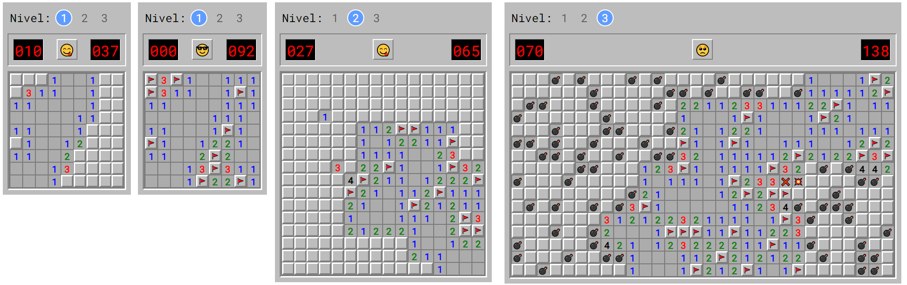

# Buscaminas

minesweeper game for web, programmed with Vue and css grid

## link github pages

[Buscaminas](https://jstewardgt.github.io/buscaminas/)

## screenshot



## Used tools

1. Vue

2. CSS

3. HTML

## Project setup
```
npm install
```

### Compiles and hot-reloads for development
```
npm run serve
```

### Compiles and minifies for production
```
npm run build
```

### Run your tests
```
npm run test
```

### Lints and fixes files
```
npm run lint
```

### Customize configuration
See [Configuration Reference](https://cli.vuejs.org/config/).
